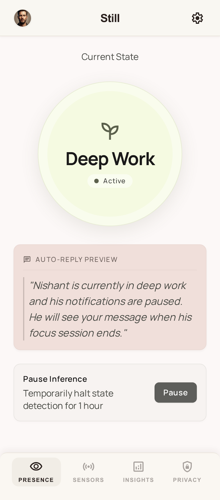

# Still

Privacy-first Android MVP for context-aware availability.



## What v1 Does

- Reads accelerometer and light sensor on device.
- Lets user set ambient audio, heart rate, peripheral, and device-place hints manually.
- Runs deterministic fuzzy sensor logic locally.
- Generates one-line human auto-reply without network calls.
- Shows privacy guardrails in UI.
- Shows current availability on lock screen through a public notification.

## Build

Open in Android Studio or run Gradle from local install:

```sh
gradle :app:assembleDebug
```

This repo intentionally avoids network permissions and cloud services in v1.
